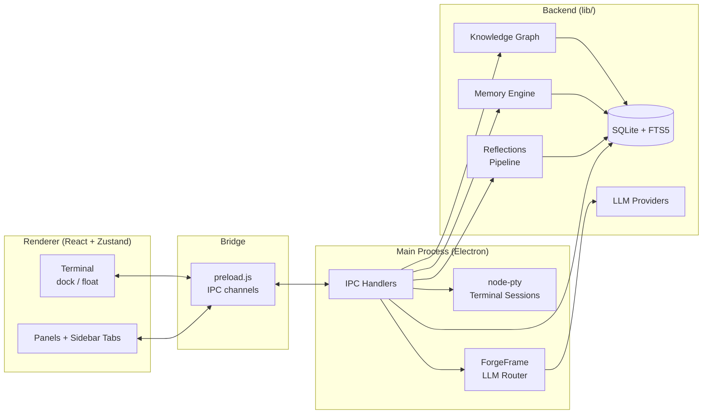
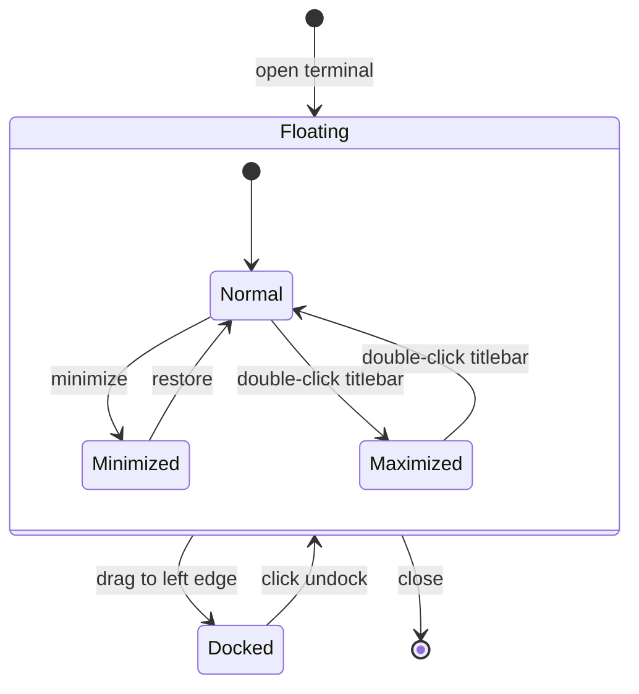

# Guardian

**A cognitive operating system for people who think in layers.**

31,700+ lines. 24 backend modules. 30 React components. Intent-based model routing across local and cloud providers. Runs fully air-gapped or scales through APIs.

<!--  -->

---

## What it is

Guardian is infrastructure for your mind. Not a note-taking app. Not a chatbot. A persistent memory layer that learns how you think, helps you navigate complexity, and remembers what matters.

It's for the people who have 47 browser tabs open, three unfinished thoughts in different tools, and the nagging sense that they've solved this problem before but can't remember where.

---

## Why it exists

We're drowning in context. Every conversation with AI starts from zero. Every tool forgets what the last one knew. Every decision requires rebuilding the same mental scaffolding over and over.

Guardian remembers. Not just what you said, but what you *meant*. Not just facts, but patterns. Not just answers, but the questions you didn't know to ask yet.

---

## What it does

**Persistent memory.** Your conversations don't disappear. They accumulate into a living knowledge base that gets smarter the more you use it.

**Semantic navigation.** Find what you need by what it *means*, not what you called it three months ago.

**Reflections.** Import your Claude and ChatGPT conversation history. Search by words, meaning, or open-ended inquiry. Your past thinking becomes navigable infrastructure.

**Context preservation.** Jump between projects without losing your train of thought. Guardian holds the threads.

**Integration queue.** When information conflicts, Guardian doesn't overwrite. It asks. You decide. You stay sovereign.

---

## How it works



Guardian sits between you and AI. Every conversation flows through it. Every insight gets remembered. Every pattern gets recognized.

After each AI response, a sequential pipeline enriches the memory layer:


Each stage reads from and writes to the same SQLite database. Sequential execution avoids concurrent write contention.

It uses semantic memory (vectors for machines) and symbolic architecture (meaning for humans). Local-first, privacy-preserving, yours.

---

## Who it's for

**The architects.** People who design systems, not just use them. PMs, strategists, researchers, builders.

**The overwhelmed.** People managing more complexity than any one brain should hold.

**The pattern-seekers.** People who see connections others miss and need tools that keep up.

**The sovereignty-minded.** People who want their thinking to be *theirs*, not rented from a cloud somewhere.

---

## What it's not

Guardian is not:
- A productivity hack
- A replacement for thinking
- A chatbot with memory
- Another place to organize notes

It's infrastructure. The kind you don't notice until it's gone.

---

## Systems

**ForgeFrame** -- Intent-based model routing engine. Analyzes query complexity and dispatches across frontier, open-source, and local LLM providers. Matches lightweight models to simple tasks, reserves premium tiers for complex reasoning.

**Hierarchical memory** -- Multi-stage compression pipeline with strength decay and retrieval reinforcement. Long-running dialogue distills into persistent knowledge that retrieves in milliseconds.

**Knowledge graph** -- Post-conversation pipeline extracts entities and relationships with semantic indexing. Unstructured dialogue becomes a searchable graph automatically.

**Reflections** -- Import and search your Claude and ChatGPT conversation archives. Full-text search, semantic similarity, and open-ended inquiry across your entire history. Your past thinking becomes a navigable, searchable layer.

**Quality assurance** -- Classifies AI responses to detect unintended reframing of user intent. Triggers corrections in real time when accuracy degrades past threshold.

**Awareness detection** -- Identifies recurring unresolved topics across sessions. Flags patterns you keep circling back to but haven't resolved.

**Sidebar architecture** -- Seven lazy-loaded panel tabs behind an activity bar: sessions, search, queue, memory, reflections, knowledge graph, and notes. Each panel is self-contained with independent state.

**Terminal** -- Real PTY via node-pty and xterm.js. Docks inline as a resizable Allotment panel or floats as a draggable window. DOM persistence across transitions means xterm instances never unmount.



---

## Current state

In active development. Used daily by its creator. Built for regulated environments where privacy isn't optional.

| Layer | Files | LOC |
|-------|------:|----:|
| Backend (`lib/`) | 24 | ~8,300 |
| Frontend (`src/`) | 45 | ~14,200 |
| Main process | 2 | ~3,000 |
| Styles | 12 | ~6,200 |
| **Total** | **83** | **~31,700** |

Early. Rough. Real.

---

## For developers

**Core principles:**
- Local-first (cloud optional, not required)
- User sovereignty (you own your data, your context, your decisions)
- Semantic + symbolic (vectors for retrieval, symbols for reasoning)
- Privacy-preserving (designed for regulated environments)

**Stack:**

| Layer | Technology |
|-------|-----------|
| Runtime | Electron 33 + Node.js |
| Frontend | React 18 + Vite |
| State | Zustand |
| Database | SQLite + FTS5 full-text search (better-sqlite3) |
| Terminal | xterm.js + node-pty (real PTY, not emulated) |
| LLM providers | Claude, OpenAI, Ollama (local), Fireworks, Moonshot |
| Model routing | ForgeFrame -- intent-based selection by complexity tier |
| Visualization | d3-force knowledge graph, Canvas rendering |

**Repository structure:**

```
guardian-ui-scaffold/
├── guardian-ui/        # Electron app (see guardian-ui/README.md for full file tree)
└── guardian-landing/   # Static landing page (Vercel-ready)
```

**Getting started:**

```bash
cd guardian-ui
npm install
npx @electron/rebuild -f -w node-pty
npm start
```

---

## Philosophy

We built tools that make us efficient. Now we need tools that make us *coherent*.

Guardian is for the space between "I know I've thought about this before" and "where the hell did I put that thought?"

It's for the cognitive load that doesn't fit in RAM but needs to be instantly accessible anyway.

It's for people who think for a living and are tired of starting from scratch every time.

---

**Guardian. Memory that doesn't fade. Context that doesn't drop. Thinking that compounds.**
