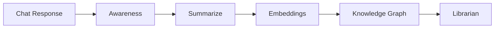

# Guardian

**External cognitive infrastructure for minds that don't turn off.**

---

## What it is

Guardian is infrastructure for your mind. Not a note-taking app. Not a chatbot. A persistent memory layer that learns how you think, helps you navigate complexity, and remembers what matters.

It's for people who have 47 browser tabs open, three unfinished thoughts in different tools, and the nagging sense that they've solved this problem before but can't remember where.

---

## What it does

**Persistent memory.** Conversations don't disappear. They accumulate into a living knowledge base that gets smarter the more you use it.

**Semantic navigation.** Find what you need by what it *means*, not what you called it three months ago.

**Reflections.** Import your Claude and ChatGPT conversation history. Search by words, meaning, or open-ended inquiry. Past thinking becomes navigable infrastructure.

**Context preservation.** Jump between projects without losing your train of thought. Guardian holds the threads.

**Integration queue.** When information conflicts, Guardian doesn't overwrite. It asks. You decide. You stay sovereign.

---

## How it works

Guardian sits between you and AI. Every conversation flows through it. Every insight gets remembered. Every pattern gets recognized.

After each AI response, a sequential pipeline enriches the memory layer:



Each stage reads from and writes to the same SQLite database. Local-first. Privacy-preserving. Yours.

---

## Systems

**ForgeFrame** -- Intent-based model routing. Analyzes query complexity and dispatches across frontier, open-source, and local LLM providers. Simple questions get fast models. Complex reasoning gets frontier models.

**Hierarchical memory** -- Multi-stage compression with strength decay and retrieval reinforcement. Long-running dialogue distills into persistent knowledge that retrieves in milliseconds.

**Knowledge graph** -- Post-conversation pipeline extracts entities and relationships with semantic indexing. Unstructured dialogue becomes a searchable graph.

**Reflections** -- Import and search Claude and ChatGPT conversation archives. Full-text search, semantic similarity, and open-ended inquiry across your entire history.

**Awareness detection** -- Identifies recurring unresolved topics across sessions. Flags patterns you keep circling back to but haven't resolved.

**Quality assurance** -- Classifies AI responses to detect unintended reframing of user intent. Triggers corrections when accuracy degrades past threshold.

---

## What it's not

Guardian is not a productivity hack, a replacement for thinking, a chatbot with memory, or another place to organize notes.

It's infrastructure. The kind you don't notice until it's gone.

---

## Current state

In active development. Early. Rough. Real.

---

## For developers

**Stack:**

| Layer | Technology |
|-------|-----------|
| Runtime | Electron 33 + Node.js |
| Frontend | React 18 + Vite |
| State | Zustand |
| Database | SQLite + FTS5 (better-sqlite3) |
| Terminal | xterm.js + node-pty (real PTY) |
| LLM providers | Claude, OpenAI, Ollama, Fireworks, Moonshot |
| Model routing | ForgeFrame -- tier-based intent dispatch |

**Repository structure:**

```
guardian-ui-scaffold/
├── guardian-ui/        # Electron app (see guardian-ui/README.md for architecture details)
└── guardian-landing/   # Static landing page
```

**Getting started:**

```bash
cd guardian-ui
npm install
npx @electron/rebuild -f -w node-pty
npm start
```

Local-first. Cloud optional. Your data, your machine, your decisions.

---

*Built because every mind deserves a guardian.*
