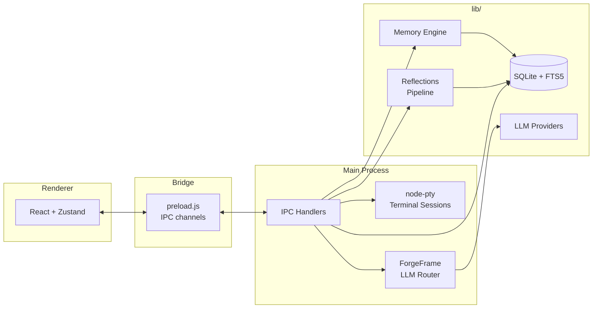
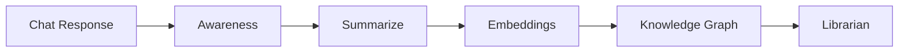
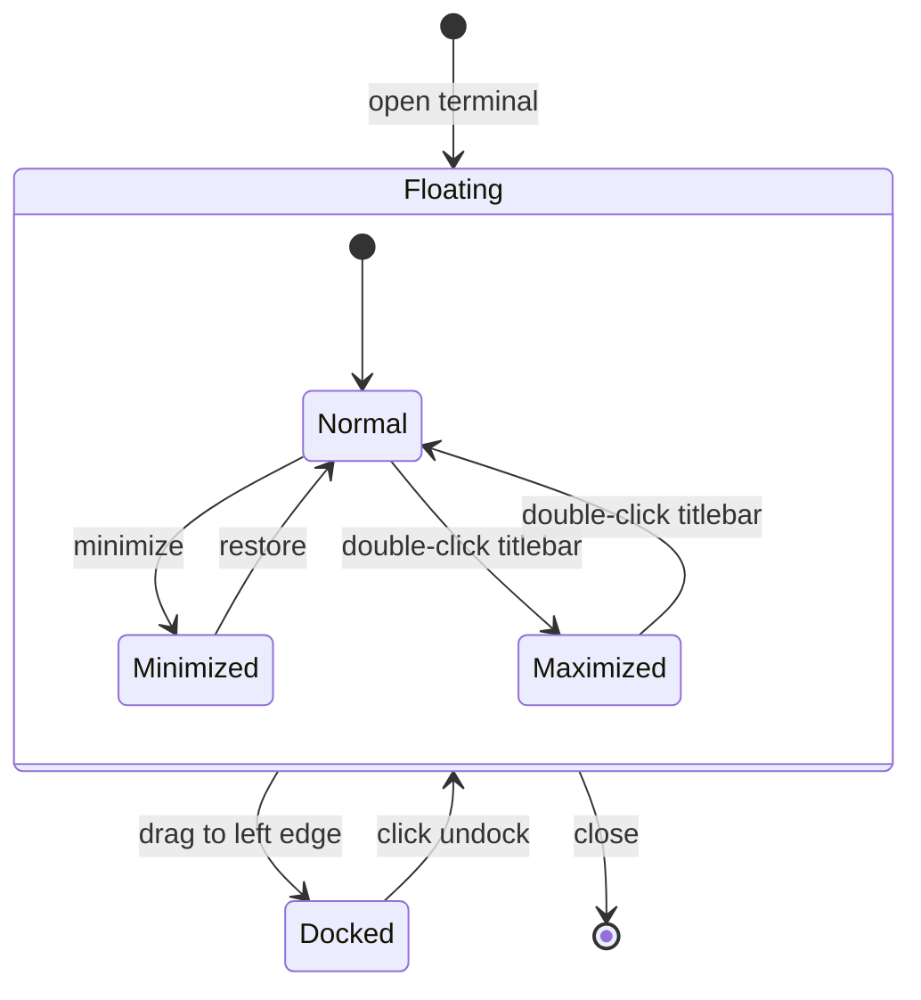

# Guardian

**External cognitive infrastructure for minds that don't turn off.**

~31,700 lines across 24 backend modules, 30 React components, and 12 stylesheets.

---

## What it is

Guardian is a persistent memory layer that learns how you think, helps you navigate complexity, and remembers what matters. Not a note-taking app. Not a chatbot. Infrastructure.

It's for people who have 47 browser tabs open, three unfinished thoughts in different tools, and the nagging sense that they've solved this problem before but can't remember where.

---

## What it does

**Persistent memory.** Your conversations don't disappear. They accumulate into a living knowledge base that gets smarter the more you use it.

**Semantic navigation.** Find what you need by what it *means*, not what you called it three months ago.

**Reflections.** Import your Claude and ChatGPT conversation history. Search by words, meaning, or open-ended inquiry. Your past thinking becomes navigable infrastructure.

**Context preservation.** Jump between projects without losing your train of thought. Guardian holds the threads.

**Integration queue.** When information conflicts, Guardian doesn't overwrite. It asks. You decide. You stay sovereign.

---

## Getting started

### Prerequisites

- Node.js 20+
- Claude Code CLI installed (for terminal integration)

### Install and run

```bash
npm install
npx electron-rebuild -f -w node-pty
npm start
```

If `npm start` doesn't work, run the two processes separately:

```bash
# Terminal 1: Vite dev server
npm run dev

# Terminal 2: Electron (after Vite is running)
npm run electron
```

### Production build

```bash
npm run build
```

---

## Stack

| Layer | Tech |
|-------|------|
| Shell | Electron 33 |
| UI | React 18 + Vite |
| State | Zustand |
| Database | SQLite + FTS5 full-text search (better-sqlite3) |
| Terminal | xterm.js + node-pty (real PTY) |
| LLMs | Multi-provider (Claude, OpenAI, Ollama, Fireworks, Moonshot) |
| Routing | ForgeFrame -- intent-based model selection by tier |
| Theme | Custom CSS (dark, brutalist-MCM) |

---

## Architecture

### Data flow



### Post-chat pipeline

After each AI response, the main process runs a sequential pipeline that enriches the memory layer:



Each stage reads from and writes to the same SQLite database. Sequential execution avoids concurrent write contention.

### Terminal lifecycle

The terminal uses a persistent DOM node (`terminalHost`) that survives transitions between docked and floating modes without unmounting xterm instances:



### Layer breakdown

| Layer | Files | LOC | Description |
|-------|------:|----:|-------------|
| Backend (`lib/`) | 24 | ~8,300 | Database, providers, memory engine, knowledge graph, reflections |
| Frontend (`src/`) | 45 | ~14,200 | React components, panels, sidebar tabs, styles |
| Main process | 2 | ~3,000 | Electron main + preload IPC bridge |
| Styles | 12 | ~6,200 | Theme, panels, sidebar, terminal, settings, onboarding |

### Project structure

```
guardian-ui/
├── main.js                    # Electron main — PTY, IPC, LLM routing (2,613 loc)
├── preload.js                 # IPC bridge (351 loc)
├── lib/
│   ├── database.js            # SQLite/FTS5 storage + reflections schema (1,403)
│   ├── providers.js           # Multi-LLM provider dispatch (801)
│   ├── librarian.js           # Entity extraction + memory librarian (609)
│   ├── backup.js              # Automated backup system (566)
│   ├── import-parser.js       # ChatGPT/Claude export parsers (454)
│   ├── awareness.js           # Drift detection, batched queries (356)
│   ├── reflections.js         # Conversation history import + FTS search (351)
│   ├── embeddings.js          # Semantic embeddings pipeline (342)
│   ├── identity-dimensions.js # Identity dimension tracking (327)
│   ├── terminal-history.js    # Terminal session history (316)
│   ├── compression.js         # Hierarchical memory compression (308)
│   ├── forgeframe.js          # Intent-based model router (297)
│   ├── knowledge-graph.js     # Knowledge graph engine (294)
│   ├── import-worker.js       # Background import processing (287)
│   ├── importer.js            # Memory import pipeline (268)
│   ├── metrics.js             # Telemetry metrics (264)
│   ├── exporter.js            # Data export (264)
│   ├── reframe-detector.js    # Cognitive reframe detection (181)
│   ├── secure-store.js        # Encrypted API key storage (176)
│   ├── performance.js         # Performance monitoring (169)
│   ├── summarizer.js          # Conversation summarization (107)
│   ├── logger.js              # Logging utility (85)
│   ├── paths.js               # Path resolution (68)
│   └── claude-cli.js          # Claude CLI integration (23)
├── src/
│   ├── App.jsx                # Layout orchestrator — Allotment, dock/undock (517)
│   ├── store.js               # Zustand global state (1,133)
│   ├── main.jsx               # React entry point (15)
│   ├── TerminalHostContext.js  # Shared DOM ref for terminal persistence
│   ├── panels/
│   │   ├── TerminalPanel.jsx  # xterm.js real terminal (610)
│   │   ├── ChatPanel.jsx      # AI conversation interface (452)
│   │   └── NotesPanel.jsx     # Markdown notes (318)
│   ├── components/
│   │   ├── SettingsPanel.jsx          # Full settings UI (935)
│   │   ├── KnowledgeGraph.jsx         # Interactive knowledge graph (504)
│   │   ├── CommandPalette.jsx         # Cmd+K command palette (424)
│   │   ├── ImportWizard.jsx           # Conversation import wizard (347)
│   │   ├── Onboarding.jsx            # First-run onboarding (315)
│   │   ├── ReflectionsExplorer.jsx    # Multi-mode reflection search (254)
│   │   ├── DimensionLandscape.jsx     # Identity dimension visualization (202)
│   │   ├── ModelPicker.jsx            # LLM model selector (197)
│   │   ├── TerminalWindow.jsx         # Floating terminal — drag, dock zones (165)
│   │   ├── MemoryExplorer.jsx         # Memory browser (163)
│   │   ├── ActivityBar.jsx            # Sidebar icon navigation (131)
│   │   ├── DimensionDetail.jsx        # Single dimension detail view (106)
│   │   ├── TokenUsage.jsx             # Token consumption display (103)
│   │   ├── DriftTab.jsx               # Drift pattern tab (93)
│   │   ├── DriftPatternView.jsx       # Drift visualization (91)
│   │   ├── SidebarContainer.jsx       # Lazy-loaded sidebar router (80)
│   │   ├── ReframeEventCard.jsx       # Cognitive reframe card (79)
│   │   ├── ReflectionConversation.jsx # Single conversation detail (72)
│   │   ├── AwarenessAlert.jsx         # Drift alert component (59)
│   │   ├── ThinkingIndicator.jsx      # AI thinking state indicator (47)
│   │   ├── ErrorBoundary.jsx          # React error boundary (44)
│   │   ├── DriftScoreBar.jsx          # Drift score progress bar (37)
│   │   └── PanelHeader.jsx            # Reusable panel header (29)
│   ├── sidebar/
│   │   ├── MemorySidebar.jsx   # Memory visualization (223)
│   │   ├── QueuePanel.jsx      # Integration queue (172)
│   │   ├── SearchSidebar.jsx   # Memory search (120)
│   │   └── SessionsPanel.jsx   # Session history browser (92)
│   └── styles/
│       ├── panels.css          # Panel layout + utilities (2,973)
│       ├── settings.css        # Settings panel styles (744)
│       ├── import.css          # Import wizard styles (421)
│       ├── terminal.css        # Terminal styles (255)
│       ├── model-picker.css    # Model picker dropdown (301)
│       ├── accessibility.css   # A11y preferences (281)
│       ├── knowledge-graph.css # Graph visualization (226)
│       ├── command-palette.css # Command palette overlay (216)
│       ├── onboarding.css      # First-run flow (177)
│       ├── terminal-window.css # Floating window positioning (155)
│       ├── sidebar.css         # Activity bar + sidebar (142)
│       ├── theme.css           # CSS variables, dark theme (77)
│       └── AwarenessAlert.css  # Alert component (96)
└── .claude/
    ├── agents/
    ├── commands/
    └── skills/
```

### Conventions

- Functional React components with hooks
- CSS with BEM-style naming (no Tailwind in Electron)
- All IPC channels prefixed with `guardian:` (e.g., `guardian:pty:create`)
- State flows: Main process -> IPC -> Zustand store -> React components
- Panel components are self-contained; each manages its own local state

---

## Current state

In development. Local-first architecture. Built because every mind deserves a guardian.

- Sidebar architecture with activity bar and 7 lazy-loaded panel tabs
- Reflections pipeline: import, FTS search, multi-mode exploration
- Terminal docks inline as a resizable panel or floats as a draggable window
- Sequential post-chat pipeline: awareness, summarize, embeddings, graph, librarian
- Layout persistence per dock mode (column proportions survive transitions)
- Knowledge graph with interactive visualization
- Multi-provider LLM routing through ForgeFrame (tier-based intent dispatch)

Early. Rough. Real.

---

*Built by people who got tired of forgetting what they already knew.*
